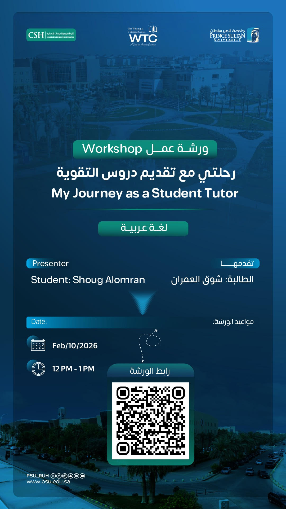

# :pencil2: My Journey as a Student Tutor
← [Back to Workshops](../index.md)

---

??? note "Workshop Poster"
    

| | |
|---|---|
| **Presenter** | Shoug Fawaz Alomran |
| **Arabic Title** | رحلتي مع تقديم دروس التقوية |
| **Institution** | Prince Sultan University – Writing & Tutoring Center (WTC) |
| **Type** | Invited speaker workshop |

---

## :open_book: Introduction

This workshop shares my personal journey as a student tutor at Prince Sultan
University — how I started, what tutoring demanded of me, and how it shaped
my growth as a student, communicator, and emerging professional. It is an
honest account of what peer teaching looks like from the inside.

---

## :woman_student: Who I Am

I am a Software Engineering and Cybersecurity student at Prince Sultan
University. Alongside my studies, I serve as a peer tutor at the Writing &
Tutoring Center, a cybersecurity trainee, and a student leader across several
clubs and initiatives.

-   :shield: **Cybersecurity Trainee**

    ---

    MDD — hands-on training in security tools, environments, and real-world
    practice.

-   :microphone: **Course Instructor**

    ---

    Qimah — delivering structured academic content in a formal teaching role.

-   :link: **Liaison Officer**

    ---

    ACM Student Chapter — connecting students to the global computing
    community.

-   :heart: **Club Member**

    ---

    Mental Health & Well-Being Club — supporting student welfare and awareness
    on campus.

---

## :chart_with_upwards_trend: How Tutoring Shaped My Journey

Stepping into a teaching role while managing my own studies pushed me to grow
in ways I didn't anticipate. I became sharper at explaining complex ideas,
more patient with different learning styles, and more deliberate about how I
prepared and communicated. Tutoring didn't just help others — it made me
better at everything else I was doing at the same time.

---

## :compass: Workshop Pages

-   :calendar: **Agenda**

    ---

    Full workshop schedule and session structure.

    [:octicons-arrow-right-24: View Agenda](agenda.md)

-   :map: **Timeline**

    ---

    My tutoring journey from start to present — key milestones and turning
    points.

    [:octicons-arrow-right-24: View Timeline](timeline.md)

-   :wrench: **Skills**

    ---

    Technical and interpersonal skills developed through tutoring.

    [:octicons-arrow-right-24: View Skills](skills.md)

-   :seedling: **Growth**

    ---

    How tutoring shaped my academic and professional development.

    [:octicons-arrow-right-24: View Growth](growth.md)

-   :speech_balloon: **Feedback**

    ---

    Feedback received from students and supervisors.

    [:octicons-arrow-right-24: View Feedback](feedback.md)

-   :bulb: **Tips**

    ---

    Practical advice for students considering peer tutoring.

    [:octicons-arrow-right-24: View Tips](tips.md)

-   :pencil: **Reflection**

    ---

    Personal reflection on the experience and its long-term impact.

    [:octicons-arrow-right-24: View Reflection](reflection.md)

-   :movie_camera: **Video**

    ---

    Workshop presentation recording.

    [:octicons-arrow-right-24: Watch Video](video.md)

